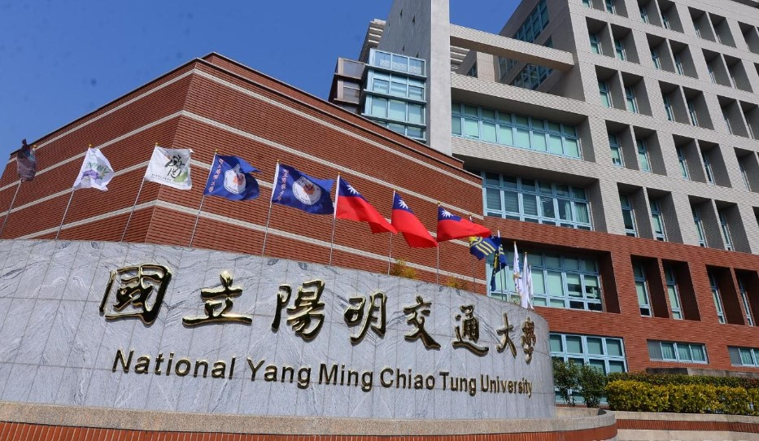

# 2025 Computer Vision
老師 : 楊元福 教授

## HW 1 : Image Sensing Pipeline
練習影像處理，從RGB到RAW，再從RAW到RGB

.png)

## HW 2 : Harris Corner Detection

實作哈里斯角點偵測（Harris Corner Detection）及相關影像處理技術，
包含高斯平滑、Sobel 邊緣檢測、結構張量計算、非極大值抑制（NMS）、影像旋轉與縮放。
哈里斯角點偵測是一種用於偵測影像中特徵點的方法，主要識別局部梯度變化劇烈的區域（如邊角）。
透過計算結構張量（Structure Tensor）並應用哈里斯響應函數（Harris Response），可以有效偵測角點。

### **原始圖片**

    

---

### **實作函式**

#### **(1) Gaussian smooth results**
**目的：** 使用高斯平滑來降低影像雜訊，以提高邊緣偵測效果。
- **高斯平滑結果（Kernel size = 5, σ = 5）**
- **高斯平滑結果（Kernel size = 10, σ = 5）**

    
    

#### **(2) Sobel edge detection results**
**目的：** 計算影像梯度，以偵測邊緣。

<table align="center">
    <tr>
        <td align="center"><b>梯度大小（Kernel size = 5）</b></td>
        <td align="center"><b>梯度大小（Kernel size = 10）</b></td>
    </tr>
    <tr>
        <td align="center"></td>
        <td align="center"></td>
    </tr>
    <tr>
        <td align="center"><b>梯度方向（Kernel size = 5）</b></td>
        <td align="center"><b>梯度方向（Kernel size = 10）</b></td>
    </tr>
    <tr>
        <td align="center"></td>
        <td align="center"></td>
    </tr>
</table>

#### **(3) Structure tensor + NMS results**
**目的：** 計算結構張量並應用非極大值抑制，以突顯關鍵角點。
- **角點偵測（視窗大小 = 3×3）**
- **角點偵測（視窗大小 = 30×30）**

    
    

#### **(4) Final results of rotating**
**目的：** 測試影像旋轉後對角點偵測的影響。
- **旋轉原始影像 30° 後的最終結果**

    

#### **(5) Final results of scaling**
**目的：** 測試影像縮放後對角點偵測的影響。
- **將原始影像縮小為 0.5 倍後的最終結果**

    

## HW 3 : Camera Calibration
